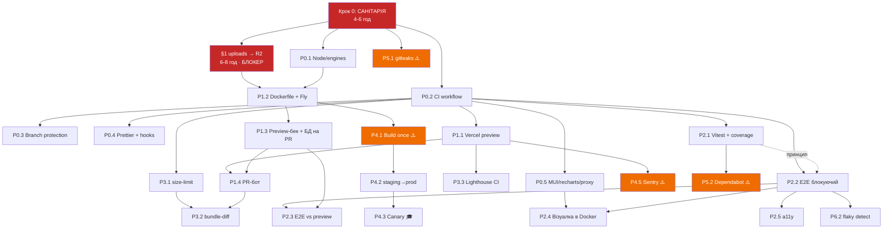

# CI/CD Pipeline — ЕТАП 3: ROADMAP

> Дата: 2026-08-11 · Гілка: `MP-004`
> Вхід: `ai/prompts/ci-pipeline.md` (ЕТАП 1–2) + `ai/prompts/to-do-in-ci-pipe.md` (твої 8 відповідей)
> Попередній звіт: `ai/reports/ci-pipeline-answer.md`
> Роль: senior DevOps/Platform інженер, режим — ментор. **Код не пишу** — чекаю на вибір порядку.

---

## 0. Контракт: що я зафіксував із твоїх відповідей

Це те, на чому побудований увесь roadmap нижче. Якщо я щось зрозумів не так — скажи зараз,
бо кожен пункт спирається на ці рішення.

| # | Рішення | Наслідок для roadmap |
|---|---|---|
| 1 | Vercel (front) + Docker на Fly.io/Railway (back) + Atlas | P1 роздвоюється: фронт-preview майже безкоштовний, бек-preview треба будувати руками |
| 2 | Atlas M0; Mongo service-container у CI, окрема БД на PR у preview | Unit/integration ніколи не бачать спільну БД. Teardown — окремий workflow на `pull_request: closed` |
| 3 | Stripe: мок у Playwright на PR + нічний ран проти реального test mode | Два різні джоби, дві різні цілі. Розписав класи багів у §8.2 |
| 4 | SLA: PR-чеки ≤ 5 хв, E2E на PR — тільки Chromium, повна матриця вночі, деплой ≤ 10 хв | **Тут є конфлікт із реальністю — див. §3. Одну річ переношу в повільну смугу вже зараз** |
| 5 | Trunk-based, branch protection зараз, squash, CODEOWNERS, merge queue — в roadmap як навчальний | Гілки розбираємо в Кроці 0. Merge queue — §8.3 |
| 6 | Спочатку санітарія (варіант «а»), категорично | Крок 0 — блокер для всього. Жодного YAML до нього |
| 7 | $0 на інструменти, до $20/міс на хостинг; репо публічний; візуалка через Playwright у Docker | Chromatic викреслено. Docker-механізм пояснив у §8.1. **Публічний репо = окремий ризик, див. Крок 0.6** |
| 8 | P0–P2 — робочий інструмент; P3–P6 — по одному, як навчальні артефакти з явним маркуванням | Кожен пункт P3–P6 нижче має обов'язковий блок «Це вправа» |

**Одна поправка як ментор.** Пункт 7: «репозиторій роблю публічним → безлімітні хвилини» —
рішення правильне за наслідками, але в ньому є прихована ціна, яку треба заплатити **до**
перемикання, а не після. Публікація репо з історією у 18 комітів — це публікація **всієї
історії**, включно з тим, що ви могли закомітити й потім видалити. Я перевіряв поточне
дерево (`git ls-files`) — там чисто. Історію я не перевіряв, бо це окремий інструмент.
Тому в Крок 0 доданий пункт «сканування історії секретів **до** публікації». Видалити
секрет із публічної історії після того, як його проіндексували боти, вже неможливо —
можна тільки ротувати ключ.

---

## 1. Окремий аудит: `server/uploads/` як блокер контейнеризації

Ти просив перевірити це окремо. Перевірив — ситуація **гірша**, ніж ти описав, і поганих
новин тут дві, а не одна.

### 1.1 Що саме відбувається

```
server/src/api/api.routes.ts:54   saveUploadToDisk()  →  fs.writeFile(process.cwd()/uploads/<uuid>.<ext>)
server/src/api/api.routes.ts:150  avatarUrl           →  "/uploads/avatar_<uuid>.jpg"
server/src/api/api.routes.ts:165  companyDocumentUrl  →  "/uploads/company_doc_<uuid>.pdf"
server/src/index.ts:50            app.use('/uploads', express.static(process.cwd()/uploads))
```

У Mongo зберігається **рядок-шлях**, а самі байти — на локальному диску контейнера.

**Проблема №1 (ти її назвав).** Ефемерна ФС. Після редеплою контейнер новий, диск порожній,
а в базі лишилися записи `avatarUrl: "/uploads/avatar_abc.jpg"`. Кожен такий запис — це
дангліг: 404 на картинці, і жодного способу відновити файл. Причому база **виглядає
здоровою** — консистентність тут не порушена з точки зору Mongo, зламані тільки посилання
в зовнішній світ. Це найгірший клас втрати даних: тихий, поступовий і помітний лише
користувачу.

**Проблема №2 (ти її не назвав, і вона серйозніша).** `express.static` віддає `/uploads/*`
**без будь-якої авторизації**. Туди складаються не тільки аватарки, а й
`company_doc` — документ компанії, тобто PII. Захист зараз — тільки те, що ім'я файлу
містить `crypto.randomUUID()`. Це «безпека через незгадуваність»: URL витікає через
Referer, через історію браузера, через будь-який лог проксі, через шаринг посилання.
Для аватарки прийнятно. Для документа компанії — ні.

### 1.2 Чому це блокер саме **перед** контейнеризацією, а не після

Порядок тут не косметичний:

- Якщо контейнеризувати спершу, ти отримаєш робочий деплой, який **тихо їсть дані**.
  Помітиш через тиждень-два, коли накопичиться десяток мертвих посилань.
- Кожен день роботи в такому стані додає рядків у Mongo, які потім треба буде
  **мігрувати або чистити** — а мігрувати нічого, бо файлів уже немає.
- Preview-енви (P1) множать проблему на кількість PR: кожен preview-контейнер має свій
  порожній `uploads/`, і будь-який тест, що заливає файл, працює тільки в межах одного рану.

Тому: **об'єктне сховище → потім Dockerfile → потім деплой.** Не навпаки.

### 1.3 Обсяг роботи (щоб ти розумів, у що вписуєшся)

| Крок | Що робимо | Оцінка |
|---|---|---|
| 1 | Абстракція `StorageAdapter` (`put/get/delete/getUrl`) поверх поточного коду | ~1 год |
| 2 | Реалізація `LocalDiskStorage` (те, що є зараз) + `S3Storage` (S3-сумісний API) | ~2 год |
| 3 | Cloudflare R2 — 10 GB безкоштовно, S3-сумісний. Вписується в $0 | ~30 хв на акаунт+бакет |
| 4 | Приватний бакет + presigned URL із TTL для `company_doc`; публічний префікс для аватарок | ~2 год |
| 5 | Прибрати `express.static('/uploads')` для документів; лишити тільки роут з авторизацією | ~1 год |
| 6 | Міграція наявних записів (їх зараз одиниці — тестові) | ~30 хв |

**Разом [оцінка]: 6–8 годин.** Це не «завтра зроблю» і не «півдня». Це реальна робота,
і вона стоїть **перед** P1 у графі залежностей.

**Як у великих компаніях.** Ніхто не пише `fs.writeFile` у продакшн-сервісі — це
відсікається на рівні код-рев'ю або взагалі не існує як варіант, бо у них немає
persistent-диска в контейнері за замовчуванням. Файли йдуть в S3/GCS через
presigned upload **напряму з браузера**, минаючи бекенд (щоб не тримати 5 MB у пам'яті
Node і не платити за трафік двічі). У нас зараз `multer.memoryStorage()` — файл проходить
через RAM бекенда.

**Наша спрощена версія і чому це виправдано.** Ми лишаємо upload через бекенд
(`multer` → `StorageAdapter` → R2), а не робимо presigned direct upload. Причина: presigned
upload вимагає CORS-конфігу на бакеті, окремого ендпойнта видачі URL і клієнтської логіки
retry. При ліміті 5 MB і десятках файлів на день economics не змінюється взагалі. Поріг,
за якого треба переходити на direct upload: файли > 25 MB **або** > ~1000 завантажень/день
(тоді RAM бекенда і його egress стають реальною статтею витрат).

---

## 2. Крок 0 — САНІТАРІЯ (блокер для всього)

Ти обрав варіант (а). Погоджуюсь і фіксую: **жодного рядка YAML, поки Крок 0 не закритий.**

### 0.1 Розібрати незакомічене

На момент цього звіту стан змінився з часу аудиту: `git status --porcelain` показує **101**
запис, з них більшість уже **застейджена** (`tests/`, `playwright.config.ts`, `@modal/`,
`payments/`, `actions/`, `error-boundary/` — вже в індексі). Тобто частину роботи ти вже
зробив між ЕТАПОМ 2 і зараз. Лишилось розкласти це на логічні коміти.

Пропоную розбивку (кожен — окремий коміт, кожен має залишати репо в стані, що збирається):

| Коміт | Що входить |
|---|---|
| 1 | `chore: add playwright config and test infrastructure` — `playwright.config.ts`, `tests/setup/`, `tests/fixtures/` |
| 2 | `test: add auth e2e specs` — `tests/auth/`, `tests/example.spec.ts` |
| 3 | `feat: add payments feature` — `src/features/payments/`, `src/app/payments/`, `server/src/payments/` |
| 4 | `feat: add intercepting routes for auth modals` — `src/app/@modal/` |
| 5 | `feat: add server actions for auth` — `src/app/actions/` |
| 6 | `feat: add error boundary and image fallback` — `src/components/error-boundary/`, `image-with-fallback/` |
| 7 | `chore: add env example and agent docs` — `server/.env.example`, `AGENTS.md` |
| 8 | `docs: add ci/cd audit reports` — `client/ai/` |

**Чому не одним комітом.** Не заради краси історії. Заради `git bisect` і заради rollback:
коли через два тижні щось зламається, ти маєш могти відкотити **платежі**, не відкочуючи
разом із ними тестову інфраструктуру. Один коміт «wip» позбавляє тебе цієї можливості
назавжди — розділити його потім уже не можна.

### 0.2 Полагодити збір тестів Playwright

`tests/auth/sign-in.spec.ts:115` → зайвий символ `}x)`. Один символ, який дає 0 зібраних
тестів і зелений exit code.

**Верифікація:** `npx playwright test --list` має показати **17 tests in 2 files**, не 0.

### 0.3 Полагодити білд

`tests/fixtures/auth.fixture.ts:54` — `Promise<Disposable>` vs `Promise<void>`.

Але корінь глибший за одну помилку типів: `client/tsconfig.json` має
`"include": ["**/*.ts", "**/*.tsx"]`, тому `next build` тайпчекає ще й `tests/`. Це
неправильна межа відповідальності — білд застосунку не повинен падати від тесту.

**Рішення:** окремий `tsconfig.test.json` для `tests/`, `tests/` виключається з основного
`tsconfig.json`. Тоді:
- `next build` перевіряє застосунок,
- `npm run typecheck:test` перевіряє тести,
- обидва — окремі гейти, які падають незалежно й кажуть різні речі.

**Альтернатива, яку я відкидаю:** просто виключити `tests/` і не тайпчекати їх взагалі.
Тоді тести гниють мовчки — а це рівно та проблема, з якої почався весь аудит.

### 0.4 Скрипти, яких немає

Зараз у `client/package.json` є лише `dev`, `build`, `start`, `lint`. Треба додати:
`typecheck`, `typecheck:test`, `test:e2e`, `test:e2e:ci`, `format`, `format:check`.
У `server/package.json` немає **нічого** з якості — треба `lint`, `typecheck`, `format:check`.

**Чому це Крок 0, а не P0.** Workflow не має містити логіку. Він має викликати
`npm run typecheck`. Якщо команда живе в YAML — ти не можеш відтворити CI локально, і
кожна діагностика падіння перетворюється на «пуш і чекай». Правило: **усе, що робить CI,
має запускатися однією командою з твого ноутбука.**

### 0.5 Прибрати сміття з ESLint

2 994 із 3 081 проблем — це `playwright-report/`. Додати в `eslint.config.mjs` ignore для
`playwright-report/`, `test-results/`, `.next/`, `coverage/`. Після цього побачимо реальне
число помилок у `src/` (~90 за оцінкою з аудиту) і зможемо вирішувати, чи робити lint
блокуючим одразу, чи спершу розгребти.

### 0.6 Сканування історії перед публікацією репо

**Новий пункт, якого не було в твоєму списку.** Перед `private → public`:

- прогнати `gitleaks detect --no-git=false` по **всій історії** (не по робочому дереву),
- окремо перевірити, чи не був закомічений `server/.env` у ранніх комітах,
- якщо щось знайдеться — **ротувати ключ**, а не переписувати історію (переписування не
  допомагає, якщо репо вже було десь опубліковане; для приватного — допомагає, але
  ротація надійніша).

Це той рідкісний випадок, коли послідовність незворотна: після публікації відкотити не
можна.

### 0.7 Розібрати гілки

На remote зараз **7** гілок: `main`, `MP-004`, `auth-feature`, `feature/auth`,
`live-coding-auth-starter`, `momot-main`, `seva/main`. (В аудиті було 6 — додалася
`seva/main`.) Кожна — або мерж, або видалення. Довгоживучих гілок після Кроку 0 бути
не повинно.

### Чекліст виходу з Кроку 0

Крок 0 закритий, коли **всі** пункти зелені:

```
[ ] git status --porcelain            → порожньо
[ ] npx playwright test --list        → 17 tests in 2 files
[ ] npm run build (client)            → успішно
[ ] npm run typecheck (client)        → 0 помилок
[ ] npm run typecheck (server)        → 0 помилок
[ ] npm run lint (client)             → відомо точне число, є рішення що з ним робити
[ ] git branch -r                     → main + максимум 1-2 активні гілки
[ ] gitleaks по історії               → чисто (або ключі ротовані)
```

**Оцінка Кроку 0: 4–6 годин.** Без `uploads`-міграції (вона окремо, 6–8 год, і потрібна
лише перед контейнеризацією).

---

## 3. Твій SLA проти реальності: де не влазить і що я переношу в повільну смугу

Ти сказав: «Якщо якийсь крок не влазить у бюджет — не оптимізуй потім, а одразу переноси
в повільну смугу і скажи мені про це». Кажу.

### 3.1 Що влазить

| Джоба | Кроки | Час на GH Actions [оцінка] |
|---|---|---|
| `quality` | checkout 5 с + setup-node/cache 15 с + `npm ci` 50 с + lint 25 с + typecheck 10 с | **~1 хв 45 с** |
| `build` | checkout + cache + `npm ci` 50 с + `next build` 30 с | **~1 хв 40 с** |
| `server` | checkout + `npm ci` 25 с + tsc 10 с + lint 10 с | **~50 с** |

Три джоби паралельно → **wall clock ~1 хв 45 с**. Бюджет 5 хв тримається із запасом.

### 3.2 Що НЕ влазить — і що я з цим роблю

**(а) E2E проти preview URL — не влазить. Переношу.**

Ланцюг «пуш → Vercel будує preview (1–2 хв) → чекаємо URL → піднімаємо preview-бекенд
(1–2 хв) → чекаємо health → E2E (2–3 хв)» — це **серійні** 5–7 хв, і вони починаються
**після** того, як відпрацювали інші джоби. Разом ~7–9 хв. Це вдвічі більше за твої 5.

**Що робимо натомість (блокуюча смуга):** E2E ганяємо **проти локально зібраного застосунку
в тій самій джобі** — `next build && next start` + бекенд у Docker-сервісі + Mongo
service-container. Ніякого очікування деплою. [оцінка] **~3 хв 30 с**, паралельно з рештою
→ загальний wall clock **~3 хв 45 с**. Влазить.

**Що йде в повільну смугу:** E2E проти справжнього preview URL — **після мержу в `main`**
(post-merge job) і **вночі**. Вони ловлять інший клас багів (конфіг деплою, змінні
середовища, CORS, cookie domain), і цей клас не варто ставити в блокуючий шлях, бо він
падає рідко, а коштує щоразу.

**(б) Візуальна регресія в Docker-образі — не влазить у блокуючу смугу. Переношу.**

Образ `mcr.microsoft.com/playwright` — це [оцінка] ~1.5 GB. Його pull на runner'і
займає **~40–90 с**, і GitHub Actions його **не кешує** між ранами (кеш docker-шарів на
hosted runner'ах не персистентний без окремого налаштування). Плюс сам ран скріншотів.

**Рішення:** візуалка — окрема джоба, **non-blocking на PR** (запускається, коментує
результат, але не блокує мерж) на етапі впровадження; переводиться в блокуючі **після
того**, як baseline стабілізується і два тижні не буде фальшивих спрацювань. Повна
візуальна матриця — nightly.

**(в) Повна матриця браузерів — ти вже сам переніс.** ✅ Chromium на PR, решта — nightly.
Погоджуюсь без правок.

**(г) Nightly проти реального Stripe — ти вже сам переніс.** ✅

### 3.3 Підсумкова карта смуг

| Смуга | Що там | Бюджет | Блокує мерж? |
|---|---|---|---|
| **Швидка (PR)** | lint, typecheck ×3, build, unit, E2E Chromium локально, size-limit | **≤ 5 хв** | ✅ так |
| **Середня (post-merge)** | E2E проти preview URL, деплой у staging, Lighthouse | ≤ 10 хв | ні |
| **Повільна (nightly)** | повна матриця браузерів, візуалка, реальний Stripe, CodeQL, SBOM | без ліміту | ні |
| **Реліз** | build once → staging → prod, smoke, canary | ≤ 10 хв від мержу | ✅ так |

---

## 4. Про твою відповідь на навчальне питання

Відповідь правильна, і термін ти вжив точний: **vacuous success**. Додам два уточнення,
бо в списку заходів є один пункт, який працює гірше, ніж ти думаєш, і один, якого бракує.

**Що працює слабше, ніж здається — поріг покриття.** «0 тестів → 0% → червоно» правда, але
поріг покриття **не ловить** сценарій, коли з 17 тестів зібралося 12. Покриття залишиться
високим, бо решта тестів покривають ті самі рядки. Покриття міряє **рядки**, а не
**наміри**. Тому явна перевірка кількості зібраних тестів (твій другий пункт) — це не
дублювання порогу покриття, а принципово інший гейт. Тримай обидва, але не вважай перший
страхуванням другого.

**Чого бракує — moving baseline.** Твій «фейл нижче мінімального порога» вимагає **вручну
підтримувати число**. Через місяць у вас 60 тестів, а поріг усе ще 15 — і зникнення 40
тестів пройде тихо. Робочий варіант: зберігати кількість зібраних тестів як артефакт
останнього зеленого рану на `main` і фейлити, якщо в PR їх стало **менше**, ніж у базі,
без явного `[test-count-drop]` у тілі PR. Це той самий принцип, що й bundle-diff з P3:
гейт не на абсолютне число, а на **дельту від бази**.

`forbidOnly: !!process.env.CI` — уже стоїть у вашому `playwright.config.ts:9`. ✅

---

## 5. ROADMAP

Формат кожного пункту:
**Що робимо** · **Проблема саме цього репо** · **+хв до CI** · **Ціна** · **Як перевірити** ·
**Як у великих** · **Наше спрощення і чому виправдане** · **Залежить від**

Усі часи — [оцінка] для `ubuntu-latest` (2 vCPU), приблизно ×2–3 від твоєї машини.

---

### P0 — ФУНДАМЕНТ (робочий інструмент, будуємо повністю)

#### P0.1 — Фіксація середовища

**Що:** `.nvmrc` з Node 22, `engines` в усіх трьох `package.json`, `packageManager` field.
**Проблема тут:** Node ніде не зафіксований. GH Actions візьме довільну LTS; коли вона
перемкнеться з 22 на 24, ви дізнаєтесь про це через падіння білду в п'ятницю ввечері.
**+хв:** 0. **Ціна:** 15 хв роботи, $0.
**Перевірка:** `actions/setup-node` з `node-version-file: .nvmrc` → у логах саме 22.x.
**Як у великих:** повна ізоляція — свій базовий образ, зафіксований до патч-версії й
digest, оновлення через окремий PR від бота.
**Наше спрощення:** `.nvmrc` з мажорною версією. Виправдано, бо ви не маєте нативних
залежностей, чутливих до мінорної версії Node (`bcrypt` компілюється, але з prebuilt).
**Поріг для суворішого:** нативні модулі без prebuilt або відтворювані білди для аудиту.
**Залежить від:** нічого. Це перший пункт узагалі.

#### P0.2 — Базовий workflow: quality gate

**Що:** `.github/workflows/ci.yml` — `pull_request` + `push: main`. Джоби `quality`,
`build`, `server` паралельно. `concurrency` з `cancel-in-progress`. Кеш npm через
`actions/setup-node` + окремий кеш `.next/cache` для Turbopack.
**Проблема тут:** CI не існує взагалі — 0 workflow, 0 хуків. Будь-хто пушить будь-що.
**+хв:** ~1 хв 45 с wall clock (детально в §3.1).
**Ціна:** $0 (публічний репо). Складність — низька.
**Перевірка:** зробити PR, що ламає тип → джоба `quality` червона; полагодити → зелена.
Другий пуш у той самий PR → перший ран **скасований** (це і є `concurrency`).
**Як у великих:** власні runner'и (self-hosted / warm pools), розподілений кеш білду
(Bazel/Nx/Turborepo remote cache), affected-детекція — перебудовується лише те, що
зачепив PR.
**Наше спрощення:** hosted runners, вбудований кеш npm, збираємо все щоразу. Виправдано:
ваш `next build` — 7,5 с локально. Affected-детекція заощадила б секунди, а коштувала б
днів налаштування.
**Поріг для суворішого:** білд > 10 хв **або** > 50 PR/день.
**Залежить від:** Крок 0 повністю.

#### P0.3 — Branch protection + CODEOWNERS

**Що:** `main` захищений, прямий push заборонений, 1 approve, обов'язкові статус-чеки,
вимога актуальності гілки, squash-only, автовидалення гілок, `.github/CODEOWNERS`.
**Проблема тут:** 7 гілок на 2–3 людей, нуль правил. Без цього **всі гейти декоративні** —
червоний CI, який нікого не зупиняє, це просто повільніший спосіб дізнатися про проблему.
**+хв:** 0 до CI, але додає час очікування рев'ю (це фіча, не баг).
**Ціна:** $0. **Увага:** на **приватному** репо branch protection недоступний на Free —
ще один аргумент за публічний, і його краще зробити в Кроці 0.6.
**Перевірка:** `git push origin main` напряму → відхилено сервером.
**Як у великих:** CODEOWNERS на сотні рядків із гранулярністю по директоріях, 2+ апрувери
на критичні шляхи, окремі правила для security-sensitive файлів, merge queue.
**Наше спрощення:** 1 апрув, один загальний CODEOWNERS. Виправдано: при 2–3 людях
«2 апрувери» означає, що один із них — обов'язково ти, і правило перетворюється на
формальність, яку ви навчитесь обходити.
**Поріг:** > 5 інженерів або регуляторна вимога (SOC2/ISO) на розділення обов'язків.
**Залежить від:** P0.2 (немає сенсу вимагати статус-чеки, яких не існує).

#### P0.4 — Prettier як гейт + локальні хуки

**Що:** `format:check` у CI, husky + lint-staged на pre-commit (тільки staged-файли).
**Проблема тут:** Prettier встановлений, конфіг є, скрипта немає — форматування не
перевіряється ніде. При 2–3 рев'юерах це diff-шум, який ховає справжні зміни.
**+хв:** ~10 с у CI, ~2 с на коміт локально.
**Ціна:** $0.
**Перевірка:** закомітити криво відформатований файл → hook переформатує; обійти хук
(`--no-verify`) → CI червоний.
**Як у великих:** форматування взагалі не доходить до CI — воно застосовується автоматично
на збереженні в IDE через спільний конфіг, а в CI стоїть як остання лінія.
**Наше спрощення:** те саме, просто без централізованої роздачі IDE-налаштувань.
**Залежить від:** Крок 0.4 (скрипти).

#### P0.5 — Гігієна репозиторію

**Що:** прибрати `recharts` (0 імпортів, ~400–500 KB), вирівняти MUI 6 vs 7, дозавершити
`middleware.ts → proxy.ts`.
**Проблема тут:** розповзання мажорів MUI загрожує Emotion SSR, а це FOUC на проді — і
жодного гейта, який це зловить (візуалка з P2 зловила б).
**+хв:** −5 с на `npm ci`.
**Ціна:** $0, але вирівнювання MUI може потягнути правки в темі — [оцінка] 1–3 год.
**Перевірка:** `npm ls @mui/material @mui/material-nextjs` → узгоджені мажори; білд без
deprecation-ворнінга.
**Залежить від:** P0.2 (щоб бачити, чи не зламали).

---

### P1 — PREVIEW-СЕРЕДОВИЩА (робочий інструмент, будуємо повністю)

> ⚠️ **P1 має жорсткий блокер: §1 (`uploads` → об'єктне сховище).** Без нього кожен
> preview-контейнер має свій порожній диск, а деплой продакшену їсть дані.

#### P1.1 — Vercel preview для фронта

**Що:** підключити репо до Vercel, root directory = `client/`, preview на кожен PR,
`X-Robots-Tag: noindex` на preview-доменах, змінні середовища окремо для preview/prod.
**Проблема тут:** деплою не існує взагалі. Ти не можеш показати гілку колезі інакше, ніж
«запусти в себе».
**+хв:** ~0 до блокуючої смуги (Vercel будує паралельно, не в GH Actions).
**Ціна:** $0 (Hobby). ⚠️ Hobby-план формально для некомерційного використання — для
навчального проєкту підходить, для реальних платежів через Stripe треба Pro ($20/міс,
тобто весь твій хостинговий бюджет).
**Перевірка:** відкрити PR → бот Vercel лишає посилання → відкрити, побачити зміну;
`curl -I` → `x-robots-tag: noindex`.
**Як у великих:** власна платформа preview-енвів на Kubernetes, namespace на PR, повний
стек (фронт + бек + БД + черги) з автоматичним TTL, seed-даними і теардауном.
**Наше спрощення:** managed Vercel для фронта. Виправдано: preview-деплої фронту — це
рівно та фіча, заради якої обирався Vercel, і будувати її самому означає витратити тижні
на відтворення того, що дається безкоштовно.
**Залежить від:** P0.2, Крок 0.

#### P1.2 — Dockerfile + деплой бекенда

**Що:** multi-stage `Dockerfile` для `server/` (builder → runtime на `node:22-alpine`,
non-root user, `HEALTHCHECK`), `fly.toml`, деплой у Fly.io.
**Проблема тут:** бекенд існує тільки локально. Без нього фронтовий preview показує
порожній застосунок — усі дані блогу, авторизація і платежі ходять у `localhost:4000`.
**+хв:** білд образу ~1,5–2,5 хв (у повільній смузі, не блокує PR).
**Ціна:** Fly.io — [оцінка] $3–7/міс за одну shared-cpu-1x машину з автостопом. Треба
перевірити актуальний прайсинг, я не пам'ятаю його з упевненістю.
**Перевірка:** `docker build && docker run` локально → `/health` віддає 200; `fly deploy`
→ той самий 200 на публічному домені.
**Як у великих:** distroless-образи, підписані (cosign/sigstore), скановані (Trivy),
задеплоєні через GitOps (ArgoCD/Flux), а не push-моделлю з CI.
**Наше спрощення:** alpine + прямий `fly deploy` з CI. Виправдано: підписи образів
вирішують проблему довіри в ланцюгу постачання, якої у вас немає — один репо, один
реєстр, три людини.
**Поріг:** мультитенантний реєстр, зовнішні контриб'ютори або комплаєнс.
**Залежить від:** **§1 (uploads → R2) — жорсткий блокер**, P0.1.

#### P1.3 — Preview-бекенд на PR + ізоляція БД

**Що:** workflow на `pull_request: opened/synchronize` → `fly deploy` в app з іменем
`mockup-api-pr-<N>` → створення бази `mockup_pr_<N>` в Atlas M0 → сід із фікстур →
запис preview-URL бекенда в змінні Vercel-preview. На `pull_request: closed` → знести
Fly-app і дропнути базу.
**Проблема тут:** без цього preview фронта нікуди не ходить, а E2E проти preview
(середня смуга) не має бекенда.
**+хв:** 2–4 хв у середній смузі.
**Ціна:** [оцінка] $2–5/міс сумарно за короткоживучі машини (Fly бере погодинно, PR живе
години-дні).
**Перевірка:** відкрити PR → зареєструватися в preview → побачити юзера в базі
`mockup_pr_<N>`, і **не побачити** його в `mockup_prod`. Закрити PR → база зникла, Fly-app
зник.
**Як у великих:** повний namespace на PR з анонімізованим зрізом продакшн-даних, TTL-
контролер, який гасить енви за розкладом і за бездіяльністю, квоти на кількість
одночасних енвів.
**Наше спрощення:** одна Fly-машина + одна база в спільному M0-кластері, teardown по
закриттю PR.
⚠️ **Технічний ризик, який треба перевірити реально, а не з голови:** M0 — це shared tier
із лімітами на кількість колекцій і на з'єднання. Скільки саме одночасних preview-баз він
витримає — я **не буду вигадувати**. `TODO: перевірити поточні ліміти M0 в документації
Atlas перед впровадженням P1.3.` Якщо впремося — план Б: preview-бекенд теж використовує
Mongo в тому ж Fly-контейнері (ще дешевше й ізольованіше, але без візуального доступу
до даних через Atlas UI).
**Залежить від:** P1.2, §1.

#### P1.4 — PR-бот із посиланнями

**Що:** один коментар у PR (оновлюваний, не новий щоразу): preview фронта, preview
бекенда, ім'я бази, статус тестів, кількість зібраних тестів.
**Проблема тут:** інформація зараз розкидана по вкладках Checks. Ніхто туди не заходить.
**+хв:** ~5 с.
**Ціна:** $0.
**Перевірка:** відкрити PR → рівно **один** коментар бота, який оновлюється при пушах, а
не плодить нові.
**Як у великих:** інтеграція в UI код-рев'ю, статуси прямо в дифі, deployment-статуси в
GitHub Deployments API.
**Наше спрощення:** один markdown-коментар.
**Залежить від:** P1.1, P1.3.

---

### P2 — ТЕСТОВА ПІРАМІДА (робочий інструмент, будуємо повністю)

#### P2.1 — Unit/component шар з нуля

**Що:** Vitest + React Testing Library + `@vitest/coverage-v8`. `passWithNoTests: false`.
Перші тести — на те, що ламається найчастіше і мовчки: Zod-схеми
(`blog.schemas.ts`, auth-схеми), мапери в `server/src/db/repositories.ts`,
`token.service.ts` (хешування refresh-токена, ротація).
**Проблема тут:** **0 unit-тестів**. Уся піраміда стоїть на 17 E2E, з яких донедавна
працювало 0. Це не піраміда — це перевернутий конус.
**+хв:** ~30–50 с.
**Ціна:** $0 інструментів; [оцінка] 8–15 год на написання перших ~40 змістовних тестів.
**Перевірка:** зламати мапер у `repositories.ts` (наприклад, прибрати `avatarUrl`) → падає
unit-тест **за 3 секунди**, а не E2E за 4 хвилини.
**Як у великих:** обов'язкове покриття на змінених рядках (patch coverage), мутаційне
тестування на критичних модулях, test impact analysis.
**Наше спрощення:** глобальний поріг покриття, що зростає (ratchet: не нижче, ніж на
`main`). Виправдано: patch coverage вимагає інтеграції на кшталт Codecov; ratchet дає
90% ефекту безкоштовно.
**Поріг:** > 10 інженерів, коли «глобальне покриття» перестає бути чиїмось персональним.
**Залежить від:** Крок 0, P0.2.

#### P2.2 — E2E у блокуючій смузі (локальний стек)

**Що:** джоба `e2e`: Mongo service-container → сід із фікстур → `next build && next start`
→ бекенд у Docker → Playwright, тільки проєкт `chromium`. Мок Stripe через
`page.route()`. Перевірка кількості зібраних тестів (§4). Артефакти (trace, video) —
тільки при падінні.
**Проблема тут:** 17 E2E-тестів існують і не запускаються ніде, крім твого ноутбука.
**+хв:** ~3 хв 30 с (паралельно з іншими; wall clock PR → ~3 хв 45 с).
**Ціна:** $0.
**Перевірка:** зламати текст кнопки в `SignInForm.tsx` → E2E червоний, trace в артефактах
показує момент падіння.
⚠️ **Один момент у вашому конфізі:** `workers: process.env.CI ? 1 : undefined`
(`playwright.config.ts:11`) — один воркер у CI. На 17 тестах прийнятно, на 60 стане
вузьким місцем. Не чіпаю зараз, але це перше, що треба буде підняти, коли джоба вилізе
за 4 хв. Тоді ж — шардинг через `--shard=i/n` і matrix.
**Як у великих:** тисячі E2E, десятки шардів, автоматичне карантинування flaky, окремі
кластери runner'ів.
**Наше спрощення:** один шард, `retries: 2` (вже стоїть).
⚠️ **Ментор-зауваження про `retries: 2`:** ретраї **ховають** flaky-тести. Тест, який
пройшов із другого разу, зараз рахується як зелений і ти про нього не дізнаєшся. Це
прийнятно на старті, але з P6.2 (детект flaky) обов'язково прийде рахунок. Запам'ятай це
місце.
**Залежить від:** Крок 0.2, P0.2, P2.1 (не технічно, а за принципом: E2E не мають ловити
те, що мав зловити unit).

#### P2.3 — E2E проти preview URL (середня смуга)

**Що:** та сама Playwright-збірка, `baseURL` = preview-URL з P1.1, після мержу і вночі.
**Проблема тут:** локальний E2E не перевіряє **конфігурацію деплою** — CORS між
Vercel-доменом і Fly-доменом, `sameSite: strict` куки на різних доменах (а у вас уся
авторизація на HttpOnly-куках — це реальний ризик саме тут), змінні середовища.
**+хв:** 5–7 хв, поза блокуючою смугою.
**Ціна:** $0.
**Перевірка:** зламати `FRONTEND_URL` у Fly-секретах → локальний E2E зелений, preview-E2E
червоний. Це і є доказ, що шар не зайвий.
**Залежить від:** P1.1, P1.3, P2.2.

#### P2.4 — Візуальна регресія в Docker

**Що:** `toHaveScreenshot()`, снапшоти в git, генерація і порівняння **виключно** всередині
`mcr.microsoft.com/playwright` — і локально, і в CI. Детальний механізм — §8.1.
**Проблема тут:** MUI-тема + Emotion SSR + розповзання мажорів MUI (P0.5). Зламаний
Emotion SSR дає FOUC і зсув layout — жоден із наявних гейтів цього не бачить, а візуалка
бачить одразу.
**+хв:** ~2–3 хв (pull образу ~40–90 с). **Non-blocking спочатку** (§3.2).
**Ціна:** $0 грошей; git-репо росте на снапшотах ([оцінка] 100–300 KB на скріншот у PNG).
**Перевірка:** змінити `spacing` у темі на 1px → джоба червона, в артефактах — diff-
зображення з підсвіченою різницею.
**Як у великих:** Chromatic/Percy/Applitools — рендер-ферма з нормалізацією шрифтів,
AI-групування diff'ів, окремий UI для затвердження змін.
**Наше спрощення:** Docker + `toHaveScreenshot()`. Виправдано бюджетом $0, і — важливіше —
ти **зрозумієш механізм**, а не купиш чорну скриньку.
**Ціна спрощення, яку треба знати наперед:** затвердження нових baseline буде ручним
(`--update-snapshots` + коміт), а diff доведеться дивитися в артефактах, а не в зручному UI.
**Залежить від:** P0.5 (спочатку вирівняти MUI, інакше baseline будете переписувати).

#### P2.5 — a11y-гейт

**Що:** `@axe-core/playwright` у наявних E2E: на ключових сторінках — фейл на
violations рівня `critical`/`serious`.
**Проблема тут:** у `ai/reports/accessibility-audit.md` уже є аудит — тобто проблеми
відомі, але **не зафіксовані гейтом**, і нічого не заважає їм повернутися.
**+хв:** ~15 с (усередині наявної E2E-джоби).
**Ціна:** $0. Треба буде спершу закрити наявні violations, інакше гейт червоний з дня 1.
**Перевірка:** прибрати `aria-label` з іконкової кнопки → джоба червона з назвою правила.
**Як у великих:** a11y-гейт + ручний аудит зі скрінрідером + зовнішній аудит раз на рік.
**Наше спрощення:** тільки автоматика. Чесно: axe ловить [оцінка] ~30–40% реальних
проблем доступності. Це не «доступно», це «немає грубих помилок».
**Залежить від:** P2.2.

---

### P3 — ПЕРФОРМАНС ЯК ГЕЙТ

> 🎓 **На масштабі цього проєкту це надлишково.**
> **Реальна проблема, яку це вирішує:** повільна деградація бандла — кожен PR додає
> 20 KB, ніхто не помічає, через рік застосунок вантажиться 8 секунд на 3G.
> **Поріг, за якого стає обов'язковим:** коли є **реальні користувачі на мобільному
> інтернеті** і бізнес-метрика, прив'язана до швидкості (конверсія, bounce). Або коли
> команда > 5 і ніхто не тримає в голові всю картину залежностей.
> **Чому все-таки не найнижчий пріоритет:** аудит показав, що ти **фізично не можеш**
> сказати, скільки важить сторінка — Next 16 із Turbopack не друкує per-route таблицю.
> `size-limit` тут закриває сліпу зону, а не додає прикрас.

#### P3.1 — `size-limit` на конкретні чанки
**+хв:** ~20 с. **Ціна:** $0. **Перевірка:** додати важку залежність → джоба червона з
різницею в KB. **Як у великих:** бюджети на кожен роут, автоматичний бісект того, який PR
додав вагу. **Наше:** 3–5 бюджетів на найбільші чанки. **Залежить від:** P0.2.

#### P3.2 — Bundle-diff коментарем у PR
**+хв:** ~30 с. **Ціна:** $0. Потребує зберігання базового виміру з `main` як артефакту.
**Перевірка:** PR з новою залежністю → коментар «+412 KB». **Залежить від:** P3.1, P1.4.

#### P3.3 — Lighthouse CI з бюджетами проти preview URL
**+хв:** 2–3 хв, **повільна смуга** (LHCI на shared runner'і дає розкид ±10 балів —
у блокуючій смузі це джерело фальшивих падінь). **Ціна:** $0.
**Перевірка:** прибрати `next/image` десь → падає LCP-бюджет. **Залежить від:** P1.1.

---

### P4 — РЕЛІЗ

> 🎓 **На масштабі цього проєкту це надлишково — частково.**
> **Реальна проблема:** розбіжність між тим, що протестували, і тим, що задеплоїли
> (build once/deploy many), і час до відновлення після поганого релізу (canary, rollback).
> **Поріг:** canary й feature flags стають обов'язковими при кількості користувачів, де
> **1% трафіку — це статистично значуща вибірка**, тобто [оцінка] від десятків тисяч
> сесій на день. **На трьох користувачах 1% — це 0.03 людини. Canary тут — це вправа, і
> в `docs/ci-cd.md` буде написано, що це вправа.**
> **Виняток:** P4.1 і P4.5 — **не** вправа, вони потрібні вже зараз (див. нижче).

#### P4.1 — Build once / deploy many ⚠️ **не вправа, робити разом із P1.2**
**Що:** один Docker-образ, тегований SHA коміту, будується раз і промотується
staging → prod. Ніяких повторних білдів на кожен енв.
**Проблема тут:** без цього ви деплоїте в прод **інший артефакт**, ніж тестували, і
відмінність може бути в чому завгодно — від оновленої транзитивної залежності до
змінної збірки. **Це не оптимізація швидкості, це питання валідності всього тестування.**
**+хв:** економить 2 хв на кожному наступному деплої. **Залежить від:** P1.2.

#### P4.2 — Staging → prod, версіонування, changelog
🎓 Вправа при 3 користувачах. **Реальна проблема:** відсутність місця, де можна побачити
реліз-кандидат цілком. **Поріг:** коли реліз перестає вміщатися в голову однієї людини.

#### P4.3 — Canary / blue-green
🎓 **Чиста вправа.** Дає тобі зрозуміти механіку зважених роутів і автоматичного promote/
rollback за метриками. **Поріг:** десятки тисяч сесій/день.

#### P4.4 — Feature flags
🎓 Вправа — **але з найближчою до реальності користю** з усього P4: дозволяє мержити
недороблену фічу в `main` за вимкненим прапорцем, тобто прибирає останній аргумент за
довгоживучі гілки (твоя мета з відповіді №5). **Поріг:** коли фіча розробляється > 3 днів.

#### P4.5 — Sourcemaps у Sentry ⚠️ **не вправа**
**Проблема тут:** у вас є `ErrorBoundary`, який ловить помилки — і нікуди про них не
повідомляє. Продакшн-стектрейс без sourcemap нечитабельний. **Ціна:** $0 (free tier).
**+хв:** ~20 с на аплоад. **Перевірка:** кинути помилку на проді → в Sentry читабельний
стек із іменами файлів. **Залежить від:** P1.1.

---

### P5 — SECURITY & SUPPLY CHAIN

> 🎓 **На масштабі цього проєкту надлишково — частково.**
> **Реальна проблема:** секрет у CI, який витік, дає доступ до продакшену; вразлива
> транзитивна залежність; скомпрометований пакет.
> **Поріг:** OIDC і CodeQL стають обов'язковими при зовнішніх контриб'юторах, при
> обробці платіжних даних під PCI, або при будь-якому комплаєнс-аудиті.
> **Виняток:** P5.1 і P5.2 — **не вправа**, і причина конкретна: ви робите репо
> **публічним** і у вас є **живі Stripe-ключі**.

#### P5.1 — `gitleaks` у CI ⚠️ **не вправа, обов'язково до публікації**
Публічний репо + Stripe + JWT-секрети + OAuth client secrets. **+хв:** ~15 с. **$0.**
**Перевірка:** PR із рядком `sk_live_...` → червоно. **Залежить від:** Крок 0.6.

#### P5.2 — Dependabot/Renovate ⚠️ **не вправа**
341 пакет у клієнті, ніхто їх не оновлює. **+хв:** 0 (окремі PR).
**Наше спрощення:** автомерж лише patch-версій і лише коли зелений CI; minor/major —
руками. **Поріг для повного автомержу:** високе покриття тестами (у вас поки 0%).
**Залежить від:** P0.2, P2.1 (автомержити без тестів — це автоматизований ризик).

#### P5.3 — OIDC замість довгоживучих секретів
🎓 Вправа для Fly/AWS. **Реальна проблема:** довгоживучий токен у GitHub Secrets, який
ніхто не ротує. **Поріг:** > 3 середовищ або доступ до хмарного акаунта з правами на
інфраструктуру.

#### P5.4 — CodeQL
🎓 Вправа (безкоштовно на публічних репо). Ловить ін'єкції, небезпечні регекси, потоки
даних. **+хв:** 3–6 хв, **тільки nightly**. **Поріг:** обробка недовіреного вводу від
анонімних користувачів у великому обсязі.

#### P5.5 — SBOM
🎓 **Чиста вправа.** SBOM потрібен, коли **хтось інший** вимагає доказ складу вашого
продукту — enterprise-закупівля, регулятор. У вас такого запитувача немає.

---

### P6 — СПОСТЕРЕЖУВАНІСТЬ ПАЙПЛАЙНА

> 🎓 **На масштабі цього проєкту надлишково.**
> **Реальна проблема:** ніхто не знає, чому CI став повільним, які тести flaky і скільки
> часу минає від коміту до продакшену.
> **Поріг:** DORA-метрики мають сенс, коли є **достатньо деплоїв, щоб рахувати частоту** —
> [оцінка] від кількох на тиждень. При 18 комітах за весь час проєкту графік частоти
> деплоїв буде графіком нуля.

#### P6.1 — Звіти по часу джоб
🎓 Найкорисніший з P6 і найдешевший. **+хв:** 0. **Поріг:** коли CI перетнув 8 хв і треба
знати, який крок винен.

#### P6.2 — Детект flaky-тестів ⚠️ **найближчий до реальної потреби з усього P6**
Причина конкретна: у вас `retries: 2` (P2.2). Ретраї роблять flaky **невидимими**.
Ця джоба знімає маску. **Поріг:** коли з'явиться перший тест, що падає раз на 10 ранів —
а він з'явиться, щойно набереться ~30 E2E.

#### P6.3 — DORA-метрики
🎓 **Чиста вправа.** Чотири метрики (частота деплоїв, lead time, MTTR, change failure rate)
створювалися для організацій, де сигнал губиться в масштабі. У команді з трьох людей ти
знаєш відповіді на всі чотири без дашборда.

---

## 6. Граф залежностей



**Що читати з графа:**
- **Червоне** — блокери. Крок 0 блокує все. `uploads` блокує весь бекендний P1.
- **Помаранчеве** — пункти з «навчальних» рівнів, які насправді **не вправа** і потрібні
  зараз через конкретні обставини цього проєкту (публічний репо, Stripe, ErrorBoundary
  без бекенда помилок).
- Пунктир `P2.1 -.принцип.-> P2.2` — це не технічна залежність, а дисциплінарна: якщо
  писати E2E раніше за unit, піраміда так і залишиться перевернутою.

---

## 7. Пріоритизація: ефект на одиницю зусиль

Ти просив мою пріоритизацію, а не «робити все підряд». Ось вона.
Ефект — 1–5, зусилля — в годинах [оцінка], ROI = ефект / зусилля.

| Ранг | Пункт | Ефект | Зусилля | ROI | Чому саме так |
|---|---|---|---|---|---|
| 🥇 1 | **Крок 0.2 — фікс `}x)`** | 5 | 0,05 год | **100** | Один символ повертає 17 тестів із небуття. Найдешевша дія в усьому документі |
| 🥈 2 | **Крок 0.3 — tsconfig для тестів** | 5 | 0,5 год | **10** | Розблоковує білд, тобто розблоковує геть усе |
| 🥉 3 | **P0.2 — базовий CI** | 5 | 2 год | **2,5** | З цього моменту жодна зламана зміна не потрапляє в `main` непоміченою |
| 4 | **P0.3 — branch protection** | 5 | 0,5 год | **10** | Без нього P0.2 декоративний. Технічно — 10 хвилин у налаштуваннях |
| 5 | **P5.1 — gitleaks** | 4 | 0,5 год | **8** | Публічний репо + Stripe. Дешево і незворотно важливо |
| 6 | **P0.1 — Node/engines** | 3 | 0,25 год | **12** | Формально найвищий ROI після фіксу символу, але ефект відкладений |
| 7 | **P0.4 — Prettier + hooks** | 3 | 1 год | **3** | Прибирає diff-шум одразу |
| 8 | **P1.1 — Vercel preview** | 5 | 1,5 год | **3,3** | Це те, заради чого все почалося. Дешево, бо managed |
| 9 | **P2.2 — E2E у CI** | 5 | 3 год | **1,7** | 17 тестів починають захищати вас щодня |
| 10 | **P4.5 — Sentry** | 4 | 1,5 год | **2,7** | ErrorBoundary нарешті перестає ковтати помилки мовчки |
| 11 | **P5.2 — Dependabot** | 3 | 0,5 год | **6** | Високий ROI, але **не робити до P2.1** — автомерж без тестів шкідливий |
| 12 | **P2.1 — Vitest** | 5 | 12 год | **0,4** | Найвищий ефект і найбільша ціна. Це марафон, не спринт |
| 13 | **§1 — uploads → R2** | 4 | 7 год | **0,6** | Низький ROI, але **жорсткий блокер** — обійти не можна |
| 14 | **P1.2+P1.3 — бекенд-preview** | 4 | 8 год | **0,5** | Найдорожча частина P1. Тут ти реально вчишся контейнеризації |
| 15 | **P2.4 — візуалка** | 3 | 4 год | **0,75** | Ефект залежить від того, як часто ви чіпаєте UI |
| 16 | **P3.1 — size-limit** | 3 | 1 год | **3** | Закриває сліпу зону, яку показав аудит |
| 17 | **P2.5 — a11y** | 2 | 2 год | **1** | Аудит уже є; гейт лише фіксує результат |
| 18+ | решта P3–P6 | 1–2 | різне | **< 1** | Навчальна цінність висока, продуктова — низька. По одному |

**Мій висновок із таблиці.** Перші **шість** пунктів — це [оцінка] **~4 години роботи**,
і після них у вас є повноцінний робочий CI з захищеним `main`. Усе інше — це вже
покращення того, що працює. Різниця між «немає CI» і «є базовий CI» на порядок більша,
ніж між «базовий CI» і «CI з canary-деплоями».

---

## 8. Пояснення, які ти замовив

### 8.1 Docker-механізм для скріншотів — детально

Ти сказав, що це один із головних уроків. Розписую повністю.

**Чому взагалі виникає проблема.** `toHaveScreenshot()` порівнює PNG **попіксельно**.
Щоб порівняння мало сенс, картинка має бути **детермінованою**: ті самі вхідні дані —
той самий байтовий вивід. Але рендеринг сторінки залежить не лише від коду:

| Джерело недетермінізму | Що конкретно змінюється |
|---|---|
| **Набір шрифтів в ОС** | Якщо шрифт не знайдено, ОС підставляє **свій** fallback. macOS підставить Helvetica, Ubuntu — DejaVu Sans. Різна ширина гліфів → різні переноси рядків → зсув усього нижче |
| **Растеризація** | macOS і Linux по-різному згладжують шрифти (subpixel antialiasing vs grayscale). Той самий гліф того самого шрифту дає **різні пікселі по краях** |
| **GPU / рендер-бекенд** | Апаратне прискорення дає інші результати для градієнтів, тіней, `border-radius`, ніж програмний рендер |
| **Версія браузера** | Chromium 140 і 141 можуть по-різному округляти субпіксельні позиції |
| **Масштаб і viewport** | `devicePixelRatio` 2 на Retina vs 1 на runner'і — просто інший розмір картинки |

Результат без ізоляції: ти генеруєш baseline на MacBook, CI на Ubuntu порівнює — і ти
отримуєш червону джобу з дифом у 3% пікселів, де **код не змінювався взагалі**. Через
тиждень таких падінь команда починає ігнорувати візуалку. Це та сама смерть від
недовіри до сигналу, про яку ти писав у відповіді про vacuous success.

**Що робить Docker.** Образ `mcr.microsoft.com/playwright:v<версія>-<дистрибутив>` містить:
- зафіксовану ОС (Ubuntu певної версії),
- **зафіксований набір системних шрифтів** — це ключове,
- зафіксовані бінарники Chromium/Firefox/WebKit, зібрані під цю саме версію Playwright,
- усі системні бібліотеки рендерингу (fontconfig, freetype, harfbuzz) фіксованих версій.

Тобто **весь ланцюг «текст → гліфи → растр → пікселі» однаковий** незалежно від того, де
крутиться контейнер. Твій MacBook при цьому ніяк не бере участі в рендерингу: Docker
на macOS запускає Linux-VM, і Chromium усередині нічого не знає про macOS.

**Практично це виглядає так:**

```
Оновлення baseline (локально):
  docker run --rm -v $(pwd):/work -w /work \
    mcr.microsoft.com/playwright:v<X>-<дистрибутив> \
    npx playwright test --update-snapshots
                ↓
  снапшоти комітяться в git

Перевірка (CI):
  той самий образ, та сама команда без --update-snapshots
                ↓
  байт-у-байт те саме оточення → diff тільки якщо змінився код
```

**Три правила, без яких це не працює:**

1. **Ніколи не оновлювати baseline поза контейнером.** Один `npx playwright test -u`,
   запущений напряму на macOS, отруює baseline, і наступний CI-ран падає на всьому.
   Це має бути npm-скрипт (`test:visual:update`), який **сам** загортає команду в
   `docker run` — щоб зробити неправильно було складніше, ніж правильно.
2. **Тег образу пінити точно.** Не `:latest`. Версія образу має відповідати версії
   `@playwright/test` у `package.json`, і оновлюватися вони мають одним PR — інакше
   оновлення Playwright тихо змінить рендеринг і дасть масовий diff.
3. **Прибрати недетермінізм у самому застосунку.** Docker фіксує оточення, але не фіксує
   ваш код. Анімації MUI (`Fade`, `Grow`), `Date.now()` у UI, лоадери, дані з бекенда,
   що змінюються — усе це дасть flaky-скріншоти **всередині** ідентичного контейнера.
   Playwright має для цього `animations: 'disabled'` і `mask` для динамічних областей.

**Що цей підхід НЕ вирішує (чесно):**
- **Затвердження змін.** Коли ти навмисно змінив кнопку, треба подивитися diff і оновити
  baseline. У Chromatic це кнопка «Approve» у зручному UI. У нас — скачати артефакт,
  подивитися PNG, запустити `--update-snapshots` у контейнері, закомітити. Це реально
  повільніше, і на 50+ снапшотах відчуватиметься.
- **Вагу репозиторію.** Кожен baseline — PNG у git. Git не вміє дельта-стискати PNG (вони
  вже стиснуті), тож кожне оновлення додає повний файл в історію назавжди.
  [оцінка] 30 снапшотів × 200 KB × 10 оновлень за рік = ~60 MB історії. Терпимо, але
  знай про це.
- **Час.** Pull образу — 40–90 с на кожному ран (§3.2). Це і є причина, чому візуалка
  йде в повільну смугу.

**Як у великих компаніях.** Або платний сервіс (Chromatic/Percy/Applitools) — і тоді
проблема шрифтів вирішена на їхньому боці рендер-фермою; або **власна** рендер-ферма
на тому самому принципі, що описано вище, просто в промислових масштабах. Принцип
ідентичний — фіксоване оточення рендерингу. Ти будуєш маленьку версію того самого.

### 8.2 Stripe: які класи багів ловить кожен рівень і що проскакує

Ти обрав дворівневу схему. Розкладаю, що саме кожен рівень бачить і чого не бачить.

**Рівень 1 — мок на рівні мережі (`page.route()`), на кожному PR**

| Ловить | Приклад із вашого коду |
|---|---|
| Помилки UI-логіки станів | Спінер не зникає після `succeeded`; кнопка «Оплатити» лишається активною і дозволяє подвійний сабміт |
| Неправильну обробку кодів помилок | `card_declined` показує «Щось пішло не так» замість зрозумілого тексту |
| Поламану навігацію після оплати | Редірект на `/payments/return` не відбувається або втрачає query-параметри |
| Регресії в рендері форми | Stripe Elements не змонтувався через зміну в провайдерах |
| Race conditions у клієнті | Юзер натиснув «назад» під час обробки |

| **НЕ ловить** | Чому |
|---|---|
| Зміну контракту Stripe API | Мок повертає те, що ви **написали в мок**. Stripe може змінити структуру відповіді, депрекейтнути поле — мок цього не знає й буде зеленим вічно |
| Помилки в `payment.gateway.ts` | Мок перехоплює **мережу браузера**. Серверний код, що ходить у Stripe через SDK, у цьому сценарії взагалі не виконується |
| Помилки версіонування API | `STRIPE_API_VERSION` неправильна → серверний SDK впаде на проді, мок нічого не помітить |
| Логіку вебхука цілком | Вебхук приходить **від Stripe на ваш сервер**. Браузер у цьому не бере участі. `page.route()` тут структурно безсилий |
| Помилки верифікації підпису | `stripe.webhooks.constructEvent()` (`payment.gateway.ts:101`) — не виконується жодного разу |
| Ідемпотентність | Stripe може доставити один вебхук двічі. Мок доставляє рівно раз |

**Рівень 2 — реальний Stripe test mode, nightly**

| Ловить | Чому саме він |
|---|---|
| Зміни контракту API | Реальна відповідь від реального Stripe. Якщо поле зникло — ви дізнаєтесь уночі, а не від користувача |
| Помилки серверного SDK | `payment.gateway.ts` виконується по-справжньому, з реальним ключем і реальною версією API |
| Верифікацію підпису вебхука | `constructEvent` з реальним `whsec_` і реальним тілом запиту. Це **єдиний** спосіб перевірити, що `express.raw()` стоїть у правильному місці |
| Помилку «raw body з'їдено» | Класика: `express.json()` застосований глобально перед вебхуком → тіло вже розпарсене → підпис не сходиться. У вас це передбачено (`index.ts:46` монтує вебхук **перед** `express.json()`), але це рівно та річ, яку ламає невдалий рефакторинг, і зловити її може **тільки** реальний виклик |
| Асинхронну природу платежу | Реальний вебхук приходить із затримкою. Ваш код або витримує це, або має race condition |

| **НЕ ловить навіть цей рівень** | Чому |
|---|---|
| Відмінності test mode від live mode | Ліміти, ризикові правила, 3DS-політики, доступність методів оплати — у test mode інші |
| Реальні банківські відмови | Test-картки симулюють коди, але не поведінку конкретного банку-емітента |
| Продакшн-конфіг | Ключі, вебхук-ендпойнти, домени в live-акаунті — інші об'єкти |
| Навантаження | Rate limits Stripe у test mode ви не досягнете |

**Головний висновок для тебе.** Ці два рівні ловлять **майже неперетинні** множини багів.
Це не «швидкий і повільний варіант того самого» — це два різні інструменти. Мок відповідає
на питання «чи правильно поводиться мій UI, коли Stripe каже X». Реальний ран відповідає
на питання «чи правильно я взагалі розмовляю зі Stripe». Другого питання мок не ставить
**у принципі**.

Саме тому «просто мокати все» — типова помилка: набір тестів росте, впевненість росте,
а цілий клас інтеграційних багів лишається невидимим до продакшену.

### 8.3 Merge queue: коли він стає необхідним

Ти правильно вирішив не вмикати. Пояснюю, **яку саме проблему** він вирішує, щоб ти
впізнав момент.

**Проблема називається semantic conflict (або mid-air collision).**

```
main:  A
       ├── PR#1: перейменовує getUser() → fetchUser()     — CI зелений (проти A)
       └── PR#2: додає новий виклик getUser()             — CI зелений (проти A)

Мержимо обидва → main = A + PR#1 + PR#2 → БІЛД ЧЕРВОНИЙ
```

Жоден із двох PR не був поганим. Обидва були перевірені. Зламала їх **комбінація**, якої
не існувало в момент перевірки. Git-конфлікту тут немає — файли різні. Тому «вимога
актуальності гілки» (require branches to be up to date), яку ти вмикаєш у P0.3, це рівно
той самий захист, тільки ручний: вона змушує оновити гілку від `main` перед мержем,
і CI ганяється на фактичній комбінації.

**Чому «вимога актуальності» перестає масштабуватися.** Вона серіалізує мержі: після
кожного мержу **всі** інші відкриті PR стають неактуальними, і кожен треба оновити
й перечекати CI заново. При CI у 5 хв це означає, що ви фізично не змержите більше
~12 PR на день, і кожен мерж «скидає» роботу решти.

**Merge queue** робить те саме автоматично: ставить PR у чергу, збирає **спекулятивні**
комбінації (main+A, main+A+B, main+A+B+C) паралельно й мержить ті, що зелені, а
винуватця викидає з черги.

**Пороги, за яких він стає необхідним:**

| Сигнал | Число |
|---|---|
| Мержів на день | [оцінка] > 10–15 |
| Інженерів, що активно мержать | [оцінка] > 8 |
| Тривалість CI × мержів на день | якщо > ~50% робочого дня — черга обов'язкова |
| Симптом, який ви помітите першими | «Я оновив гілку від main, і поки ганявся CI, main знову змінився» — повторюється **щодня** |

**Ваш зараз:** 18 комітів за весь час проєкту, 2–3 людини. До порогу — щонайменше
порядок величини. Вмикати merge queue зараз означало б додати чергу очікування там, де
черги немає. Тримай у голові як діагностику, а не як інструмент.

---

## 9. Що робити далі — обери порядок

Три варіанти. Я рекомендую перший, але вирішуєш ти.

### Варіант A — «Фундамент» (рекомендую) [оцінка] ~8 год до першого зеленого CI

```
Крок 0 (санітарія, 4-6 год)
  → P0.1 Node          (15 хв)
  → P0.2 CI workflow   (2 год)
  → P0.3 Protection    (30 хв)
  → P5.1 gitleaks      (30 хв)  ← до публікації репо
  → P0.4 Prettier      (1 год)
```
**Що отримуєш:** захищений `main`, кожен PR перевіряється, секрети не витечуть.
**Чому рекомендую:** це перші 6 рядків таблиці ROI. Найбільша віддача на годину роботи
в усьому документі.

### Варіант B — «Побачити результат швидше» [оцінка] ~11 год
```
Крок 0 → P0.1 → P0.2 → P0.3 → P1.1 (Vercel preview) → P1.4 (PR-бот)
```
**Що отримуєш:** те саме, що в A, плюс живе посилання в кожному PR — тобто **видимий**
результат, який приємно показати.
**Ціна:** preview показує фронт **без робочого бекенда** (він ще локальний), тому
авторизація й платежі в preview не працюватимуть до P1.2/P1.3.

### Варіант C — «Спочатку тести» [оцінка] ~19 год
```
Крок 0 → P0.2 → P0.3 → P2.2 (E2E у CI) → P2.1 (Vitest)
```
**Що отримуєш:** реальну впевненість у коді раніше за все інше.
**Чому не рекомендую першим:** P2.1 — це 12 годин написання тестів. Ти вигориш на цьому
до того, як побачиш працюючий пайплайн, а мотивація в навчальному проєкті — обмежений
ресурс.

---

## 10. Правила, яких я триматимусь на ЕТАПІ 4

Фіксую наперед, щоб ти міг мене на цьому ловити:

- **Один логічний крок = один набір змін = один PR-опис.** Не вивалю все разом.
- **Перед кожним кроком** — що зміниться, чому саме так, і яку альтернативу я відкинув.
- **Версії actions не вигадую.** Де не впевнений — скажу прямо і додам `TODO: перевірити`,
  або запропоную пінити по commit SHA. У цьому документі я вже позначив два такі місця:
  ліміти Atlas M0 (§P1.3) і прайсинг Fly.io (§P1.2).
- **Після кожного кроку** — (а) чекліст ручної перевірки, (б) що побачиш в UI CI,
  (в) як відкотити.
- **Окремий блок «ЩО ЗРОБИТИ МЕНІ РУКАМИ»** для всього, що можу зробити тільки ти
  (секрети, branch protection, підключення Vercel/Fly/Atlas/R2, перемикання репо в public).
- **P3–P6** — кожен із блоком «На масштабі цього проєкту це надлишково / Реальна
  проблема / Поріг» у `docs/ci-cd.md`. Формулювання вже написані вище — перенесу дослівно.
- **Зупинятиму тебе**, якщо захочеш інструмент без проблеми за ним. Перший такий стоп уже
  стався в §8.3 (merge queue) і §P6.3 (DORA).

---

## 11. Навчальні питання перед ЕТАПОМ 4

**Питання 1 (по §3.2).** Я переніс E2E проти preview URL із блокуючої смуги в
post-merge. Це означає, що баг у конфізі деплою (наприклад, зламані CORS між
Vercel-доменом і Fly-доменом) **потрапить у `main`** і виявиться вже після мержу.
Як думаєш — це прийнятний компроміс? І що конкретно має статися, щоб я його переглянув?

*(Куди думати: яка ціна такого багу в `main` при trunk-based? Порівняй її з ціною
+4 хвилин на кожному PR, помножених на кількість PR за місяць.)*

**Питання 2 (по P4.1).** Ти в промпті питав, чому build once/deploy many важливіший за
швидкість. Тепер, коли ти бачиш, що у вас **три** різні артефакти (Next-білд на Vercel,
Docker-образ бекенда, самі снапшоти візуалки) — спробуй сформулювати сам: що конкретно
може відрізнятися між staging і prod, якщо кожен збирається окремо? Назви **три** речі,
що можуть розійтися, навіть якщо коміт **той самий**.

*(Одна з трьох — прямо у вашому `package.json`.)*

---

## Що далі

Скажи, який варіант обираєш — **A**, **B** чи **C** (або свій порядок). Після цього
переходжу до **ЕТАПУ 4** і пишу реальні файли під цей репозиторій: твій npm, твої шляхи,
твої назви скриптів.

Почну з **Кроку 0**, і перший набір змін буде найменшим із можливих — фікс одного символу
в `sign-in.spec.ts` і розділення `tsconfig`. Щоб перший зелений чекмарк з'явився швидко
і чесно.
